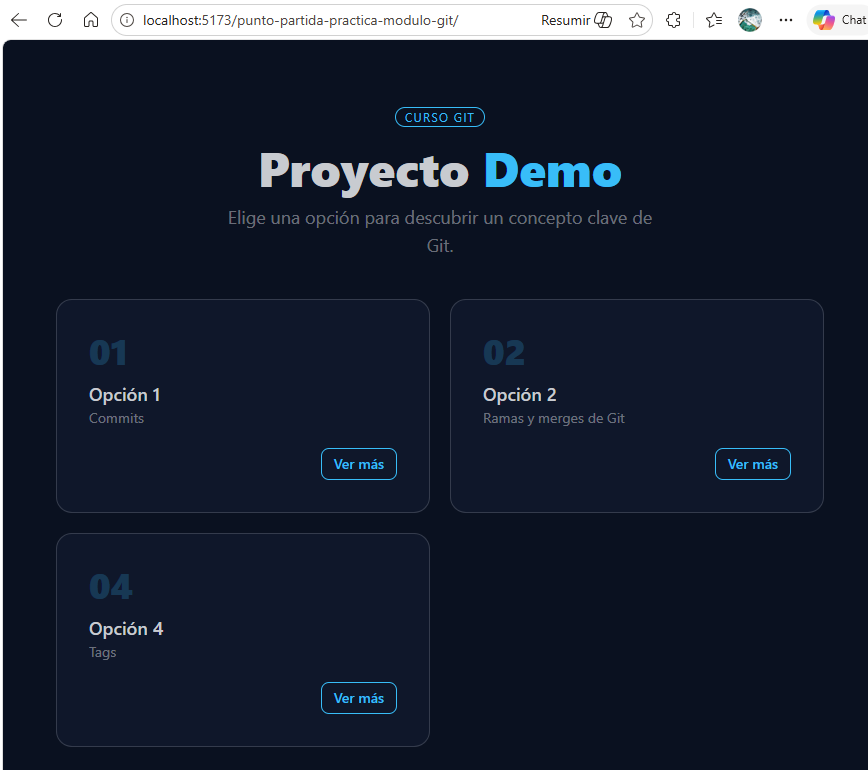
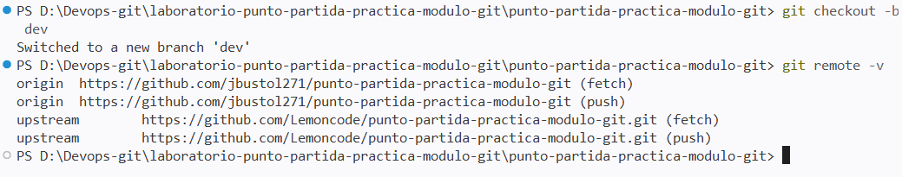
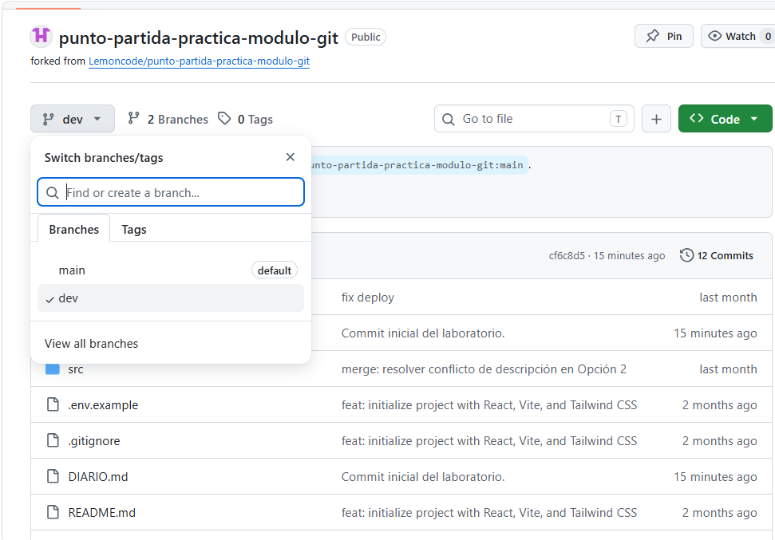

# Laboratorio — Flujo Git colaborativo

## Descripción

Este laboratorio es la prueba de evaluación del módulo de Git. Vas a reproducir, de forma autónoma, el mismo flujo de trabajo profesional que viste en clase: fork, ramas, commits, Pull Requests y resolución de conflictos.

---

## Objetivo 

Se parte de la aplicación React que usasteis en clase. El repositorio del instructor tiene en estos momentos tres opciones visibles y una oculta por feature flag.
Hay qye realizar:
 * 2 nuevas opciones mediante el flujo de ramas y PRs
 * Provocar un conflicto real entre ellas y resolverlo.

## Requisitos previos

Antes de empezar comprueba que tienes:

- Git instalado y configurado con tu nombre y email
- Node 18 o superior (`node -v`)
- Cuenta en GitHub
- VS Code instalado

---

## Verificaciones previas

Lo primero que he realizado es:
* Clonar mi repositorio local (https://github.com/jbustol271/punto-partida-practica-modulo-git) el cual esta en el estado de punto de partida del laboratorio.
* Verificar los requisitos de node. La versión que tengo es v24.14.1.
* Comprobar que la aplicación está operativa según es estado inicial del punto de partida. Se accede a la aplicación despues de instalar npm (11.12.1) y lanzar la misma.


---
### Capturas obligatorias

| #   | Qué debe mostrar la captura                                                       |
| --- | --------------------------------------------------------------------------------- |
| 1   | Terminal con `git remote -v` mostrando `origin` y `upstream`                      |
| 2   | GitHub con la rama `dev` visible en el desplegable de ramas                       |
| 3   | La app en el navegador con la Opción 5 recién añadida                             |
| 4   | El PR de Feature A en GitHub con la pestaña **Files changed** abierta             |
| 5   | El PR de Feature B en GitHub mostrando el banner rojo de conflicto                |
| 6   | Los marcadores de conflicto (`<<<<<<<`, `=======`, `>>>>>>>`) en VS Code          |
| 7   | La app en el navegador con todas las opciones visibles tras resolver el conflicto |
| 8   | Terminal con `git log --oneline` en `main` mostrando todos los commits            |

El `DIARIO.md` debe commitearse y pushearse a tu fork antes de la entrega.
---

## Tareas obligatorias
---
### Tarea 1 — Fork y configuración inicial

He realizado la clonación de mi repositorio local (https://github.com/jbustol271/punto-partida-practica-modulo-git) el cual esta en el estado de punto de partida del laboratorio con git clone -- aqui tenemos origini y tambien lo he enlazado con el upstream de origen. 



Rama dev en mi fork



> **Diario:** Escribe qué es un fork y para qué sirve `upstream`. 

* **fork:** Un fork es una copia completa de un repositorio que se crea en tu propia cuenta de GitHub.
* **upstream:** Cuando haces un fork, Git crea dos “remotos” posibles origin que es tu repositorio (tu fork) u upstream que es el repositorio original del que hiciste el fork.
Upstream sirve para mantener tu fork actualizado con los cambios del repositorio original, sin upstream, tu fork se queda desactualizado.
---
### Tarea 2 — Feature branch A: añadir la Opción 5

Esta rama parte de `dev`.

1. Crea la rama `feature/opcion-5` desde `dev`.
2. Abre `src/app.tsx` y añade la siguiente tarjeta al array `OPTIONS`:

```tsx
{
  id: 5,
  title: "Opción 5",
  description: "Pull Request",
  message:
    "Una Pull Request es una propuesta formal para incorporar cambios de una rama a otra. Permite revisar el código antes de mergear y deja un historial claro de qué se hizo y por qué.",
  featureFlag: false,
},
```

3. Además, cambia el campo `description` de la **Opción 3** de su valor actual a:

```tsx
description: "Flujo de trabajo",
```

4. Arranca la app y verifica en el navegador que aparece la Opción 5.
5. Haz un commit con el mensaje: `feat: añadir Opción 5 y actualizar descripción de Opción 3`
6. Sube la rama a tu fork.

> **Diario:** Explica por qué la rama parte de `dev` y no de `main`. Adjunta la captura 3.

---

### Tarea 3 — Feature branch B: añadir la Opción 6 (aquí está el conflicto)

**Importante:** crea esta rama **ahora**, antes de mergear la Tarea 2. Ambas ramas deben partir del mismo punto en `dev`.

1. Vuelve a `dev` y crea la rama `feature/opcion-6` desde ahí.
2. Abre `src/app.tsx` y añade la siguiente tarjeta al array `OPTIONS`:

```tsx
{
  id: 6,
  title: "Opción 6",
  description: "gitignore",
  message:
    "El fichero .gitignore le dice a Git qué ficheros debe ignorar. Úsalo para excluir ficheros de entorno (.env), dependencias (node_modules) y cualquier cosa que no deba estar en el repositorio.",
  featureFlag: false,
},
```

3. Además, cambia el campo `description` de la **Opción 3** a:

```tsx
description: "Flujo profesional",
```

> Fíjate: la rama A cambió `description` de la Opción 3 a `"Flujo de trabajo"` y esta rama la cambia a `"Flujo profesional"`. Las dos parten del mismo valor original. Eso generará un conflicto cuando intentes mezclarlas.

4. Haz un commit con el mensaje: `feat: añadir Opción 6 y actualizar descripción de Opción 3`
5. Sube la rama a tu fork.

> **Diario:** Explica qué es un conflicto en Git y por qué se va a producir aquí.

---

### Tarea 4 — Pull Request 1: Feature A a `dev`

1. Abre una Pull Request en GitHub desde `feature/opcion-5` hacia `dev`.
2. Ponle como título: `feat: añadir Opción 5 y actualizar descripción de Opción 3`
3. Antes de mergear, abre la pestaña **Files changed** y revisa el diff.
4. Mergea el PR.
5. Actualiza tu rama `dev` local con `git pull origin dev`.

> **Diario:** Explica qué revisaste en la pestaña Files changed y por qué es útil hacerlo antes de mergear. Adjunta la captura 4.

---

### Tarea 5 — Pull Request 2: Feature B a `dev`, conflicto

1. Abre una Pull Request desde `feature/opcion-6` hacia `dev`.
2. GitHub detectará un conflicto. No podrá mergear automáticamente.
3. Resuelve el conflicto **en local** siguiendo estos pasos:
   - Ponte en la rama `feature/opcion-6`
   - Descarga `dev` con `git fetch origin dev`
   - Fusiona con `git merge origin/dev`
   - Abre `src/app.tsx` en VS Code y localiza los marcadores de conflicto
   - Decide qué versión conservar: quédate con **`"Flujo profesional"`** (tu versión de esta rama)
   - Guarda el fichero
   - Arranca la app y verifica que se ven todas las opciones correctamente
   - Haz el commit de resolución: `merge: resolver conflicto de descripción en Opción 3`
   - Sube la rama con `git push origin feature/opcion-6`
4. Vuelve al PR en GitHub. El conflicto habrá desaparecido. Mergea el PR.
5. Actualiza tu `dev` local.

> **Diario:** Explica qué significan los marcadores `<<<<<<<`, `=======` y `>>>>>>>` y qué criterio usaste para decidir qué versión conservar. Adjunta las capturas 5, 6 y 7.

---

### Tarea 6 — Limpieza y cierre del diario

1. Borra las dos feature branches en GitHub (botón **Delete branch** o desde la pestaña de ramas).
2. Bórralas también en local:

```bash
git branch -d feature/opcion-5
git branch -d feature/opcion-6
```

3. Ejecuta `git branch` y confirma que solo te quedan `main` y `dev`.
4. Asegúrate de que tu `DIARIO.md` está completo con todas las capturas y haz commit y push.

> **Diario:** Adjunta la captura 8 (`git log --oneline`). Cierra el diario con un párrafo libre: qué te ha resultado más difícil y qué tiene más sentido ahora que antes de la clase.

---

## Tareas opcionales

---

### Opcional 1 — Feature flag

1. Abre el fichero `.env` en `proyecto-demo`.
2. Cambia `VITE_FEATURE_OPCION_3` a `false` y arranca el servidor.
3. Verifica en el navegador que la Opción 3 desaparece sin tocar el código.
4. Devuelve el valor a `true` y reinicia el servidor.

> **Diario:** Explica por qué `.env` no está en Git y para qué sirve `.env.example`.

---

### Opcional 2 — PR final: `dev` a `main`

1. Abre una Pull Request desde `dev` hacia `main`.
2. Título: `release: Opciones 5 y 6 + mejoras Opción 3`
3. Revisa **Files changed** y confirma que entran todos los cambios esperados.
4. Mergea el PR.
5. Actualiza tu `main` local con `git pull origin main`.

> **Diario:** Explica por qué se hace el release desde `dev` y no directamente desde una feature branch.

---