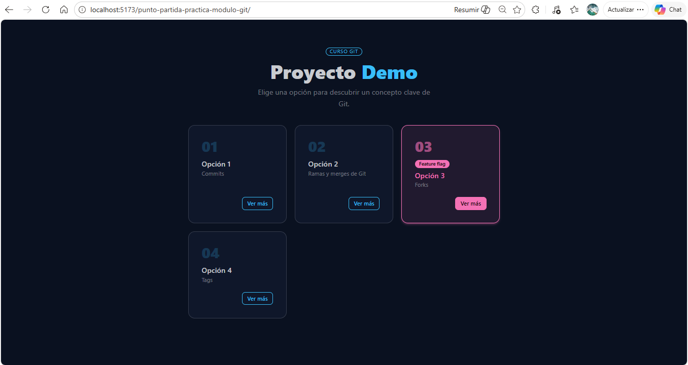
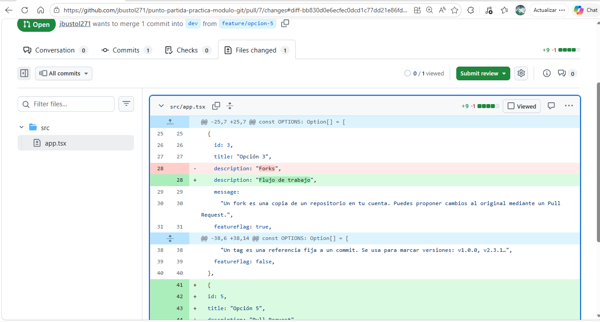
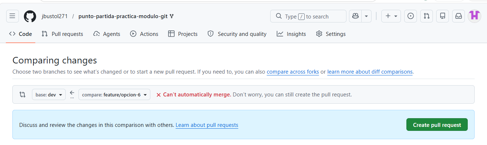
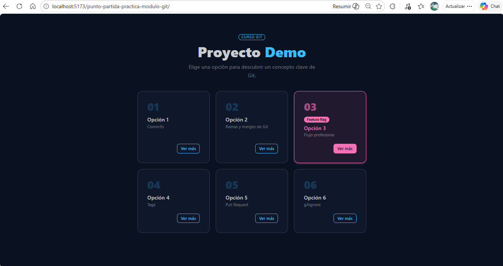

# Laboratorio — Flujo Git colaborativo

## Descripción

Este laboratorio es la prueba de evaluación del módulo de Git. Vas a reproducir, de forma autónoma, el mismo flujo de trabajo profesional que viste en clase: fork, ramas, commits, Pull Requests y resolución de conflictos.

---

## Objetivo 

Se parte de la aplicación React que usasteis en clase. El repositorio del instructor tiene en estos momentos tres opciones visibles y una oculta por feature flag.
Hay que realizar:
 * 2 nuevas opciones mediante el flujo de ramas y PRs
 * Provocar un conflicto real entre ellas y resolverlo.

## Requisitos previos

Antes de empezar comprueba que tienes:
- Git instalado y configurado con tu nombre y email
- Node 18 o superior (`node -v`)
- Cuenta en GitHub
- VS Code instalado
---

## Verificaciones previas

Lo primero que he realizado es:
* Clonar mi repositorio local (https://github.com/jbustol271/punto-partida-practica-modulo-git) el cual esta en el estado de punto de partida del laboratorio.
* Verificar los requisitos de node. La versión que tengo es v24.14.1.
* Comprobar que la aplicación está operativa según es estado inicial del punto de partida. Se accede a la aplicación despues de instalar npm (11.12.1) y lanzar la misma.



---

### Capturas obligatorias

| #   | Qué debe mostrar la captura                                                       |
| --- | --------------------------------------------------------------------------------- |
| 1   | Terminal con `git remote -v` mostrando `origin` y `upstream`                      |
| 2   | GitHub con la rama `dev` visible en el desplegable de ramas                       |
| 3   | La app en el navegador con la Opción 5 recién añadida                             |
| 4   | El PR de Feature A en GitHub con la pestaña **Files changed** abierta             |
| 5   | El PR de Feature B en GitHub mostrando el banner rojo de conflicto                |
| 6   | Los marcadores de conflicto (`<<<<<<<`, `=======`, `>>>>>>>`) en VS Code          |
| 7   | La app en el navegador con todas las opciones visibles tras resolver el conflicto |
| 8   | Terminal con `git log --oneline` en `main` mostrando todos los commits            |

El `DIARIO.md` debe commitearse y pushearse a tu fork antes de la entrega.

---

## Tareas obligatorias

### Tarea 1 — Fork y configuración inicial
Una vez realizado el fork y clonado en la maquina, he puesto en marcha la app, creado la rama remote upstream, la rama dev y la he subido a mi fork.

> **Diario:** Escribe qué es un fork y para qué sirve `upstream`. 
Un **fork** es una **copia completa de un repositorio** que se crea en tu propia cuenta de GitHub. 
Sirve para:
-   **Trabajar libremente** sobre un proyecto sin afectar al original.
-   **Proponer mejoras** mediante _pull requests_.
-   **Practicar o modificar código** sin permisos especiales.
-   **Crear tu propia versión** de un proyecto público.
**Un fork es tu copia personal de un repositorio ajeno.** Cuando haces un **fork**, GitHub crea dos repositorios:
	1. **Tu copia** → se llama `origin`
	2. **El repositorio original** → se suele añadir como `upstream`
Por tanto:
	-   `origin` = tu repositorio (tu fork)
	-   `upstream` = el repositorio original del que hiciste el fork

Sirve para **mantener tu fork actualizado** con los cambios del repositorio original.


---

### Tarea 2 — Feature branch A: añadir la Opción 5

A partir de la rama dev, he creado la rama feature/opcion-5 y añadido el codigo propuesto a src/app.tsx., también he modificado el campo `description` de la **Opción 3**

> **Diario:** Explica por qué la rama parte de `dev` y no de `main`
La rama **feature/opcion-5** parte de `dev` y no de `main` porque, siguiendo la metodología Git Flow, `dev` es la rama donde se integra todo el trabajo en desarrollo. Es decir, todas las nuevas funcionalidades deben construirse sobre `dev`, ya que es la rama que contiene el estado más actualizado del proyecto antes de preparar una release. 
Por el contrario, `main` solo debe contener código estable y listo para producción. Si una feature se creara desde `main`, estaría trabajando sobre una versión antigua del proyecto y podría generar conflictos al integrarse, además de romper el flujo de trabajo establecido.


---

### Tarea 3 — Feature branch B: añadir la Opción 6 (aquí está el conflicto)
He creado la rama feature/opcion-6 a partir de la rama dev, en esta rama he realizado las modificaciones propuestas, tarjeta nueva y modificación de la descripción de la tarjeta 3.

> **Diario:** Explica qué es un conflicto en Git y por qué se va a producir aquí. Tenemos, **dos ramas distintas** (`feature/opcion-5` y `feature/opcion-6`) que han partido de `dev` y ambas han modificado **la misma parte del archivo**, en concreto, la **descripción de la Opción 3**.
Esto significa que:
1.  La feature/opcion-5 cambió la descripción de la opción 3.
2.  La feature/opcion-6 también cambió esa misma descripción.
3.  Al querer fusionar las dos ramas en  `dev`, Git verá dos versiones diferentes de la misma línea y no puede decidir cuál es la correcta. 
Por eso aparecerá un conflicto.
---

### Tarea 4 — Pull Request 1: Feature A a `dev`

> **Diario:** Explica qué revisaste en la pestaña Files changed y por qué es útil hacerlo antes de mergear. 
> En files changed he revisado los cambios de mi rama con respecto a dev, se ha modificado la descripción de la opción 3 y que se ha añadido la opción 5, tal y como se puede ver en la imagen que se adjunta a continuación. Es recomendable revisar esto para asegurarnos de que realmente se mergea lo correcto, y no cualquier otra cosa por error.



---

### Tarea 5 — Pull Request 2: Feature B a `dev`, conflicto

> **Diario:** Explica qué significan los marcadores `<<<<<<<`, `=======` y `>>>>>>>` y qué criterio usaste para decidir qué versión conservar.
	
	* <<<<<<<: Indica el inicio del bloque de conflicto.
	Todo lo que aparece después de este marcador corresponde a mi versión local (HEAD), es decir, la versión de la rama en la que estaba trabajando cuando intenté hacer el merge.

	* =======: Separa las dos versiones en conflicto. Lo que está arriba pertenece a mi rama local.
	Lo que está abajo pertenece a la rama que estoy intentando fusionar.
	
	* >>>>>>>: Indica el final del conflicto
	
	El ide me muestra las dos versiones y me pide elegir entre una de las dos, o includo conservar ambas, para poder resolver el conflicto.






---

### Tarea 6 — Limpieza y cierre del diario

1. Borra las dos feature branches en GitHub (botón **Delete branch** o desde la pestaña de ramas).
2. Bórralas también en local:

```bash
git branch -d feature/opcion-5
git branch -d feature/opcion-6
```

3. Ejecuta `git branch` y confirma que solo te quedan `main` y `dev`.
4. Asegúrate de que tu `DIARIO.md` está completo con todas las capturas y haz commit y push.


> **Diario:** Adjunta la captura 8 (`git log --oneline`). Cierra el diario con un párrafo libre: qué te ha resultado más difícil y qué tiene más sentido ahora que antes de la clase.
Lo que me ha resultado más complicado es el tema de los conflictos y su resolución.
---
